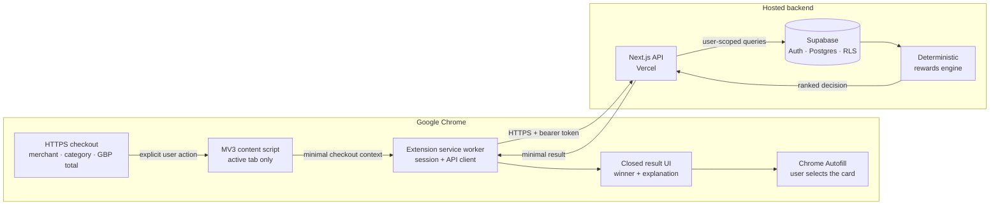

<div align="center">
  
  <h1>Pip Card Scout</h1>
  <p><strong>Pick the highest-value rewards card in your wallet at checkout.</strong></p>
  <p>
    <a href="https://github.com/Mattlo0546/pip-card-scout/actions/workflows/ci.yml"></a>
    <a href="https://github.com/Mattlo0546/pip-card-scout/releases/latest"></a>
    
    
    <a href="./LICENSE"></a>
  </p>
  <p>
    <a href="https://github.com/Mattlo0546/pip-card-scout/releases/latest"><strong>Download</strong></a>
    · <a href="#quick-start">Install</a>
    · <a href="#architecture">Architecture</a>
    · <a href="./PRIVACY.md">Privacy</a>
  </p>
</div>

Pip is a Manifest V3 Chrome extension that ranks comparison-ready UK rewards cards a user already owns. At an HTTPS checkout, it combines the merchant, inferred category, and GBP total with a source-backed card catalogue, then returns one recommendation with an auditable explanation.

This repository is the complete product: the extension, deterministic reward engine, reviewed catalogue, Supabase migrations, tests, and the small Vercel API the extension needs. **There is no consumer website.**

> [!IMPORTANT]
> **Controlled beta:** the extension is installable from GitHub today, but it uses manual Chrome Developer-mode installation. Sign in with a beta account; create one only where beta onboarding has been enabled. Unrestricted self-service signup remains gated on production SMTP, CAPTCHA, and abuse controls.

## Quick start

1. Open the [latest release](https://github.com/Mattlo0546/pip-card-scout/releases/latest).
2. Download `pip-card-scout-1.0.0.zip` and its `.sha256` file.
3. Unzip the extension into a permanent folder.
4. In Google Chrome, open `chrome://extensions` and enable **Developer mode**.
5. Select **Load unpacked** and choose the unzipped folder containing `manifest.json`.
6. Pin Pip, open it, and sign in with a beta account.
7. Search the catalogue and add the card products you actually own.
8. At an HTTPS checkout with a visible GBP total, open Pip and select **Find my best card**.
9. Use Chrome Autofill to select the physical card matching Pip's recommendation.

Chrome cannot install an unpacked extension directly from a ZIP. The Chrome Web Store version is not available yet.

<details>
<summary><strong>Optional: verify the release download</strong></summary>

Keep the ZIP and checksum in the same directory, then run one of:

```bash
# macOS
shasum -a 256 -c pip-card-scout-1.0.0.zip.sha256

# Linux
sha256sum --check pip-card-scout-1.0.0.zip.sha256
```

</details>

## What Pip does

| Step | Responsibility |
| --- | --- |
| **1. Identify** | You select the card products you own; Pip stores product references, not payment credentials. |
| **2. Understand** | On explicit activation, Pip reads the active checkout's merchant, inferred category, and GBP total. |
| **3. Compare** | The API loads your enabled cards and evaluates published reward rules with deterministic integer arithmetic. |
| **4. Explain** | Pip shows the winner, estimated reward value, comparison trace, and any relevant caveats. |
| **5. Pay** | You make the final selection using the matching card in Chrome Autofill. |

Chrome does not expose a public extension API for reading cards saved in Chrome Payments. Pip therefore never attempts to inspect that vault or automate the final payment selection.

## Architecture



The merchant page receives no Supabase token, wallet data, or payment credentials. Session tokens live in `chrome.storage.session` and disappear with the browser session. Vercel hosts only the authenticated JSON API; visiting [`pip-card-scout.vercel.app`](https://pip-card-scout.vercel.app) returns service metadata rather than a website.

## Catalogue coverage

| Metric | Current release |
| --- | ---: |
| Catalogue version | `uk-2026.09.28` |
| Current UK products catalogued | **58** |
| Comparison-ready products | **6** |
| Catalogue-only products | **52** |
| Issuer or programme groups | **22** |
| Supported checkout currency | **GBP** |
| First-party sources last reviewed | **28 September 2026** |

The six comparison-ready products have reward terms that Pip can represent deterministically. The other 52 remain available for identification but disabled in recommendations until annual-spend tiers, account-age rules, cap usage, activation state, or variable redemption value can be modelled safely.

Introductory bonuses and personalised offers are not treated as recurring base earn. Closed programmes and non-credit products are excluded. The normalized source of truth is [`catalog/uk-credit-cards.json`](./catalog/uk-credit-cards.json), with source receipts under [`research/uk-card-catalog/`](./research/uk-card-catalog/).

> [!NOTE]
> Card terms change. Pip is not financial advice; always check the issuer's current terms before relying on a recommendation.

## Security and privacy model

Pip stores only what it needs to identify and compare a user's cards:

- a catalogue product ID;
- an optional nickname and last four digits;
- whether the card is enabled; and
- optional recommendation history, which is off by default.

Pip never asks for, stores, transmits, or fills a full card number (PAN), CVC/CVV, expiry date, cardholder name, billing address, or Chrome Autofill payment data. Private wallet rows are user-scoped with Supabase Row Level Security, and administrator credentials never ship in the extension.

Read the full [privacy notice](./PRIVACY.md), [security policy](./SECURITY.md), and [production architecture](./docs/production-architecture.md).

## Repository map

```text
extension/                 Manifest V3 popup, service worker, and checkout UI
app/api/v1/                Versioned Next.js JSON endpoints
lib/                       Auth, validation, catalogue, and ranking engine
catalog/                   Normalized published UK card catalogue
research/uk-card-catalog/  First-party source receipts and review notes
supabase/migrations/       Schema, RLS policies, grants, and catalogue data
tests/                     Engine, API, security, catalogue, and contract tests
scripts/                   Catalogue build and reproducible extension packaging
docs/                      Deployment and trust-boundary documentation
```

## Local development

Prerequisites: Node.js 24+, Docker, and the Supabase CLI.

```bash
git clone https://github.com/Mattlo0546/pip-card-scout.git
cd pip-card-scout
npm ci
supabase start
supabase db reset
cp .env.example .env.local
npm run dev
```

Copy the local Supabase `anon key` and `service_role key` printed by `supabase start` into `.env.local` as `SUPABASE_ANON_KEY` and `SUPABASE_SERVICE_ROLE_KEY`.

The checked-in extension is deliberately pinned to the production API. For local extension testing, update the three API-origin locations documented in [`extension/README.md`](./extension/README.md).

### Verification and packaging

Run these commands sequentially because build and typecheck both use Next.js-generated types:

```bash
npm run lint
npm run typecheck
npm test
npm run build
npm run extension:package
```

Packaging validates the production manifest and writes a reproducible ZIP plus checksum under `dist/`. CI runs the same checks and publishes the archive as a workflow artifact. Maintainers attach that exact artifact to a tagged GitHub release; see the [deployment guide](./docs/deployment.md).

The catalogue pipeline can also be run independently:

```bash
npm run catalog:normalize
npm run catalog:build
npm run catalog:validate
```

<details>
<summary><strong>API surface</strong></summary>

All user endpoints except health and authentication require a Supabase access token as `Authorization: Bearer &lt;token&gt;`.

| Endpoint | Purpose |
| --- | --- |
| `POST /api/v1/auth/sign-up` | Create a Supabase user |
| `POST /api/v1/auth/sign-in` | Start an extension session |
| `POST /api/v1/auth/refresh` | Rotate an expired access token |
| `POST /api/v1/auth/sign-out` | Revoke the Supabase session |
| `GET /api/v1/catalog` | Read the published product and rule catalogue |
| `GET/POST /api/v1/wallet` | Read or add wallet-card references |
| `PATCH/DELETE /api/v1/wallet/:id` | Enable, disable, or remove a wallet-card reference |
| `GET/PATCH /api/v1/settings` | Read or change private-history consent |
| `GET /api/v1/history` | Read the user's private recommendation ledger |
| `POST /api/v1/recommend` | Rank the authenticated wallet and optionally log the decision |
| `DELETE /api/v1/account` | Permanently delete the authenticated account and its stored data |
| `GET /api/health` | Check backend readiness |

</details>

## Current limitations

- Recommendations support GBP checkouts and the six verified products only.
- Merchant category and MCC are inferred before settlement and may differ from the issuer's classification.
- Generic checkout detection works on many sites, but not every checkout design, iframe, or dynamically rendered total.
- The engine does not yet track every annual fee, FX fee, return adjustment, reward cap, offer activation, or previously used allowance.
- Catalogue updates require human review; issuer terms can change between releases.
- Cloud decision history is off by default. Automated retention enforcement and account export are not yet implemented.
- Installation requires Chrome Developer mode; there is no Chrome Web Store listing yet.
- Public signup requires production SMTP, CAPTCHA, and abuse-control configuration.

## Contributing

Contributions are welcome. Catalogue changes must include current first-party issuer evidence; code changes must preserve the no-payment-credentials boundary. Read [CONTRIBUTING.md](./CONTRIBUTING.md) before opening a pull request.

- Found a bug? Use the repository's bug report form.
- Have a product idea? Open a feature request.
- Found a vulnerability? Follow [SECURITY.md](./SECURITY.md) instead of opening a public issue.
- Need help installing or using Pip? See [SUPPORT.md](./SUPPORT.md).

Released under the [MIT License](./LICENSE).
